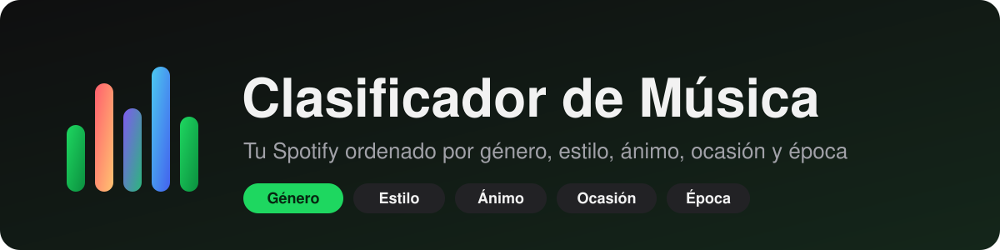
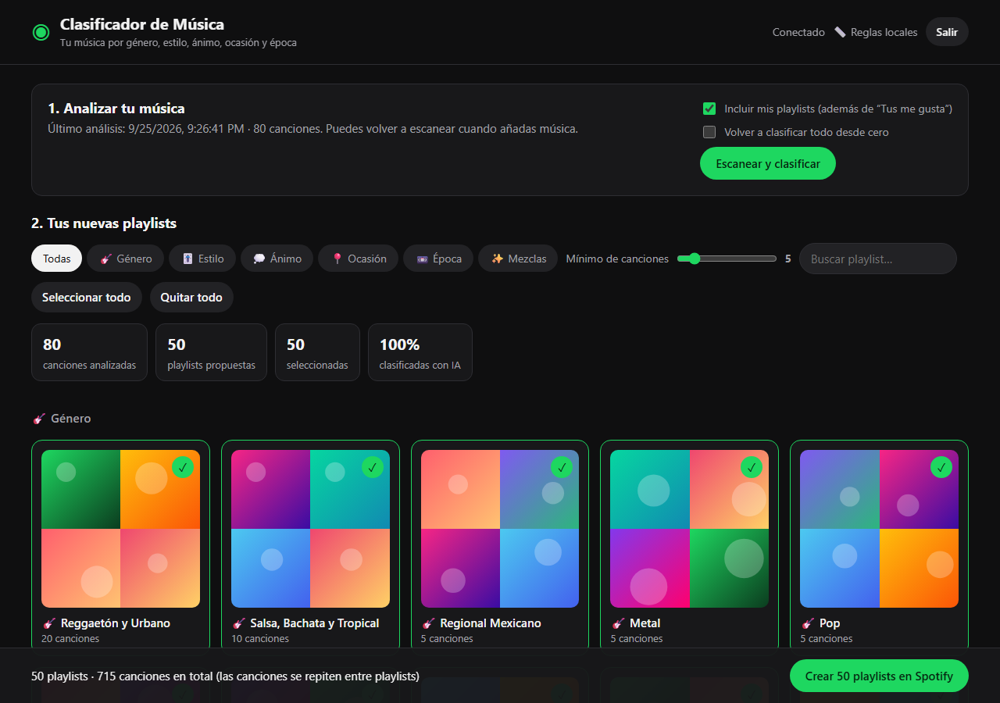
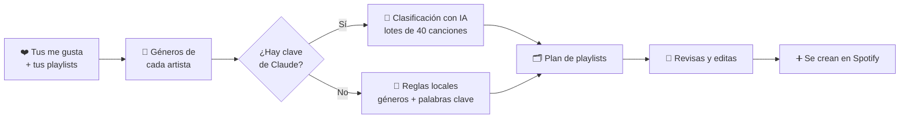

<p align="center">
  
</p>

<p align="center">
  
  
  
  
  
</p>

<p align="center">
  <b>Convierte tu lista de “Me gusta” de Spotify en decenas de playlists ordenadas<br>
  por género, estilo, ánimo, ocasión y época, en unos minutos.</b>
</p>

---

<p align="center">
  
</p>

## ✨ Qué hace

- 📥 **Lee tu música**: tus canciones de “Tus me gusta” y, si quieres, también tus playlists (sin duplicados).
- 🧠 **Clasifica cada canción** con IA (Claude) o con reglas locales gratuitas.
- 🔁 **Las canciones se repiten donde encajan**: una misma canción puede estar en *Reggaetón*, *Fiestero*,
  *Fiesta y Previa* y *Actuales* a la vez.
- 👀 **Tú decides antes de crear**: revisas cada playlist, la renombras, quitas canciones, eliges el
  tamaño mínimo y marcas cuáles quieres.
- ➕ **Crea las playlists en tu Spotify** (privadas) con un clic.
- 🛡️ **No toca tu música actual**: nunca borra ni modifica tus playlists; solo crea nuevas.
- ⚡ **Caché inteligente**: al volver a escanear solo procesa las canciones nuevas.

## 🗂️ Categorías

| | Categoría | Playlists que genera |
|---|---|---|
| 🎸 | **Género** | Reggaetón y Urbano · Trap y Hip-Hop · Pop · Pop Latino · Rock · Rock en Español · Indie y Alternativo · Metal · Electrónica · R&B y Soul · Salsa, Bachata y Tropical · Cumbia · Regional Mexicano · Baladas · Jazz y Blues · Country y Folk · K-Pop y J-Pop · Clásica e Instrumental |
| 🎚️ | **Estilo** | Bailable · Acústico · Intenso · Suave · Para cantar a gritos · Instrumental · Épico |
| 💭 | **Ánimo** | Feliz · Enérgico · Motivado · Tranquilo · Romántico · Sensual · Triste · Desamor · Nostálgico · Rabia · Fiestero |
| 📍 | **Ocasión** | Gym · Fiesta y Previa · Estudiar y Concentrarse · Trabajar · Dormir · Manejar · Mañana y Despertar · Cita y Cena · Ducha y Karaoke · Relajarse · Caminar · Con Amigos |
| 📼 | **Época** | Clásicos · Los 80 · Los 90 · Los 2000 · Los 2010 · Actuales |
| ✨ | **Mezclas** | Combinaciones frecuentes de ánimo + ocasión, p. ej. *Triste · Manejar* o *Enérgico · Gym* |

Cada canción recibe **1 género, hasta 3 estilos, 3 ánimos y 4 ocasiones**, además de su época.

## ⚙️ Cómo funciona



- **Con IA (recomendado)**: Claude recibe título, artista, álbum, año y géneros del artista, y usa lo que
  sabe de cada canción (incluida la letra) para decidir ánimo y ocasión. Si algún lote falla, esas
  canciones se clasifican con reglas.
- **Sin IA**: usa los géneros que Spotify asigna al artista y palabras clave del título
  (“amor”, “fiesta”, “sin ti”, “remix”…). Es gratis, pero más genérica.

> Spotify ya no da a las apps nuevas datos de audio como energía o bailabilidad, por eso el ánimo se
> deduce del artista, el título y el conocimiento del modelo.

## 🚀 Instalación

### Requisitos

- [Node.js](https://nodejs.org) 22 o superior
- Una cuenta de **Spotify Premium** (Spotify la exige para las apps de desarrollador desde 2026)
- *(Opcional)* Una clave de API de [Anthropic](https://console.anthropic.com) para clasificar con IA

### 1. Crea tu app de Spotify

1. Entra a <https://developer.spotify.com/dashboard> y pulsa **Create app**.
2. Rellena nombre y descripción (lo que quieras).
3. En **Redirect URIs** escribe exactamente `http://127.0.0.1:8888/callback` y pulsa **Add**.
4. Marca **Web API**, acepta los términos y pulsa **Save**.
5. En **Settings**, copia el **Client ID**.

### 2. Descarga y arranca

```bash
git clone https://github.com/erickopgaming28/clasificador-de-musica.git
cd clasificador-de-musica
```

**En Windows:** haz doble clic en **`iniciar.bat`**. La primera vez instala todo, te abre el `.env`
para que pegues tu Client ID y después abre la app en el navegador.

**En cualquier sistema:**

```bash
cp .env.example .env    # y rellena SPOTIFY_CLIENT_ID (y ANTHROPIC_API_KEY si quieres)
npm install
npm start
```

Abre <http://127.0.0.1:8888>, inicia sesión con Spotify y pulsa **Escanear y clasificar**.

### Variables de entorno (`.env`)

| Variable | Obligatoria | Descripción |
|---|---|---|
| `SPOTIFY_CLIENT_ID` | ✅ | Client ID de tu app de Spotify |
| `ANTHROPIC_API_KEY` | ➖ | Activa la clasificación con IA |
| `PORT` | ➖ | Puerto local (por defecto `8888`; si lo cambias, cambia también el Redirect URI) |

## 🧩 Estructura del proyecto

```
├── iniciar.bat            arranque con doble clic (Windows)
├── src/
│   ├── server.js          servidor local: escaneo, plan de playlists y creación
│   ├── spotify.js         cliente de la Web API (PKCE, reintentos, endpoints de 2026)
│   ├── classify-ai.js     clasificación con Claude
│   ├── classify-rules.js  clasificación por reglas
│   └── taxonomy.js        géneros, estilos, ánimos, ocasiones y épocas
├── public/                interfaz web (HTML + CSS + JS sin frameworks)
└── data/                  caché local (se crea sola, no se sube a git)
```

¿Quieres otras categorías? Edita `src/taxonomy.js` (y los perfiles de `src/classify-rules.js` si usas reglas).

## ❓ Problemas frecuentes

| Problema | Solución |
|---|---|
| `INVALID_CLIENT: Invalid redirect URI` | El Redirect URI debe ser exactamente `http://127.0.0.1:8888/callback` (con `127.0.0.1`, no `localhost`, y sin `/` final). |
| Error 403 al iniciar sesión | La cuenta no es la dueña de la app o no es Premium. |
| “No pude leer” una playlist | La API solo deja leer playlists tuyas o colaborativas; las demás se saltan. |
| Muchas canciones en “Otros” | Algunos artistas no tienen géneros en Spotify. Activa la IA para mejores resultados. |

## 🔒 Privacidad

Todo corre **en tu ordenador**. Tu sesión de Spotify y la caché se guardan en la carpeta `data/`.
Si activas la IA, solo se envían a Claude los títulos, artistas, álbumes, años y géneros de las canciones.

## 📄 Licencia

[MIT](LICENSE) © erickopgaming28
